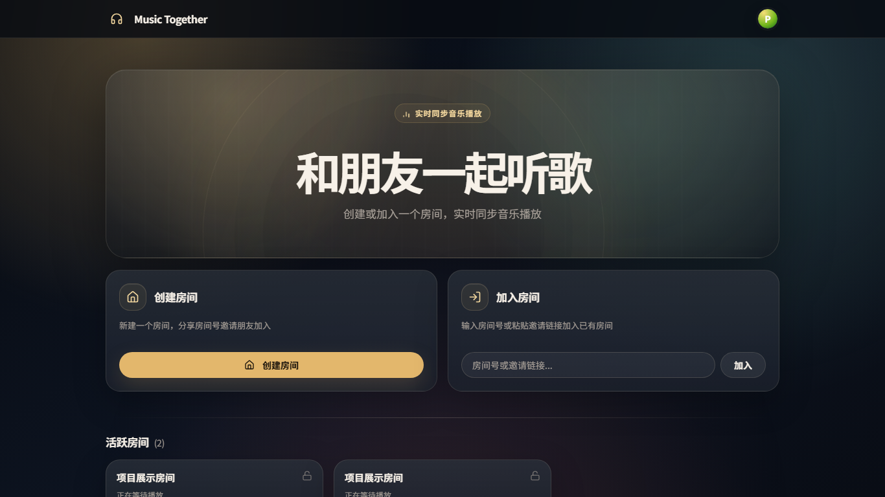
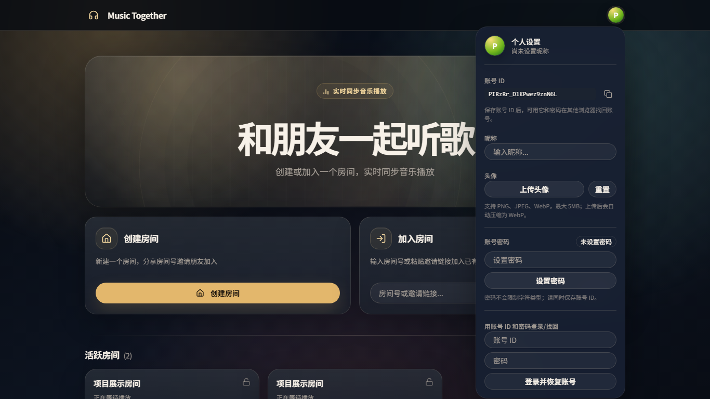
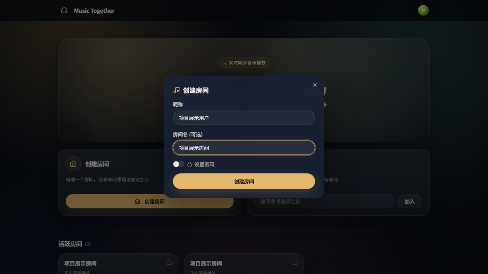
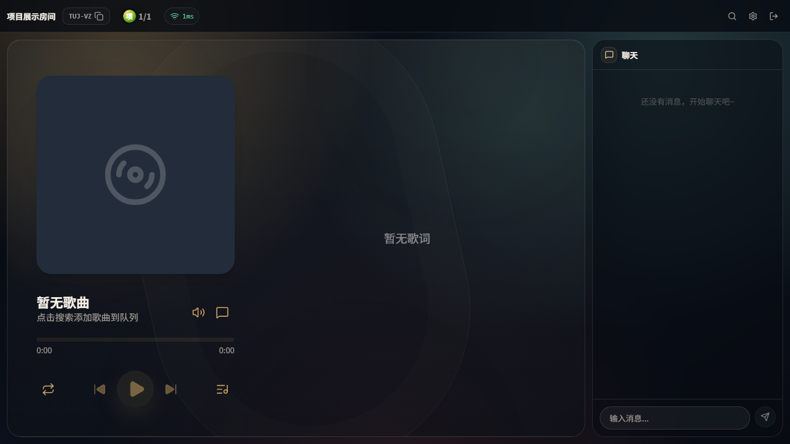
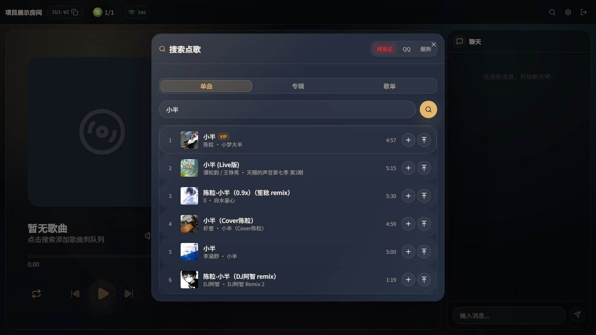
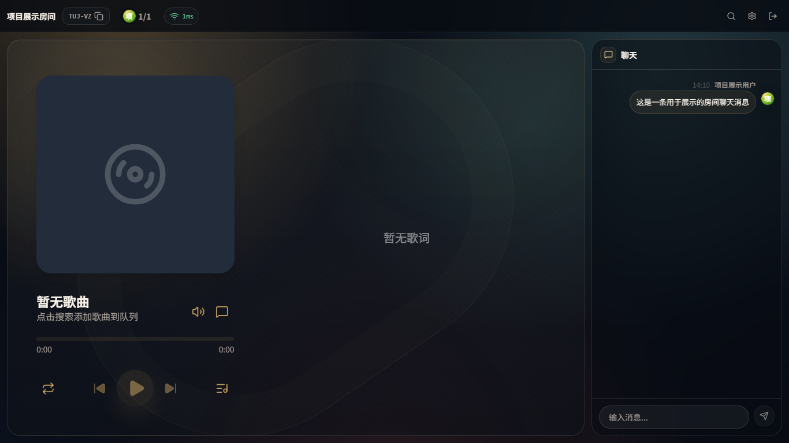
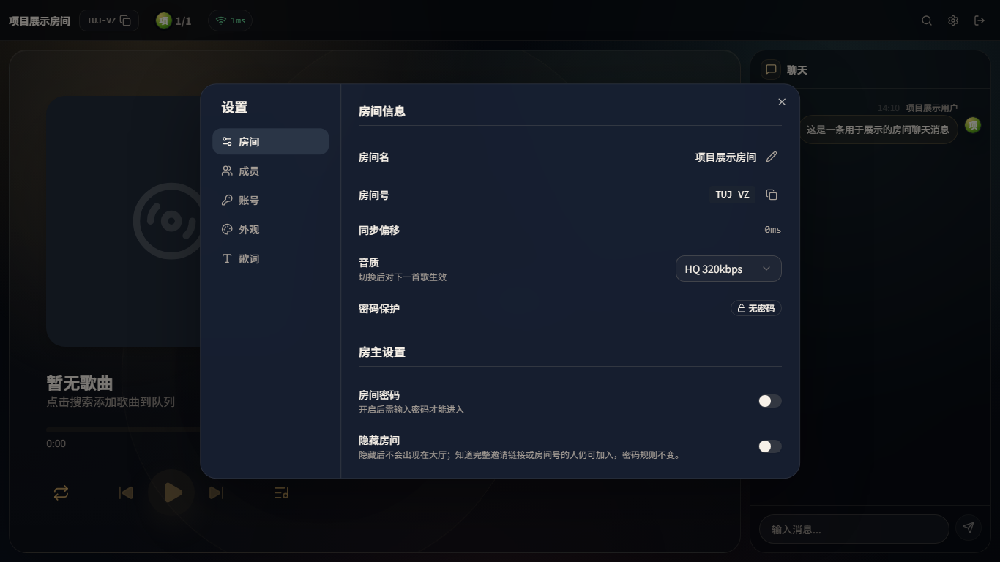
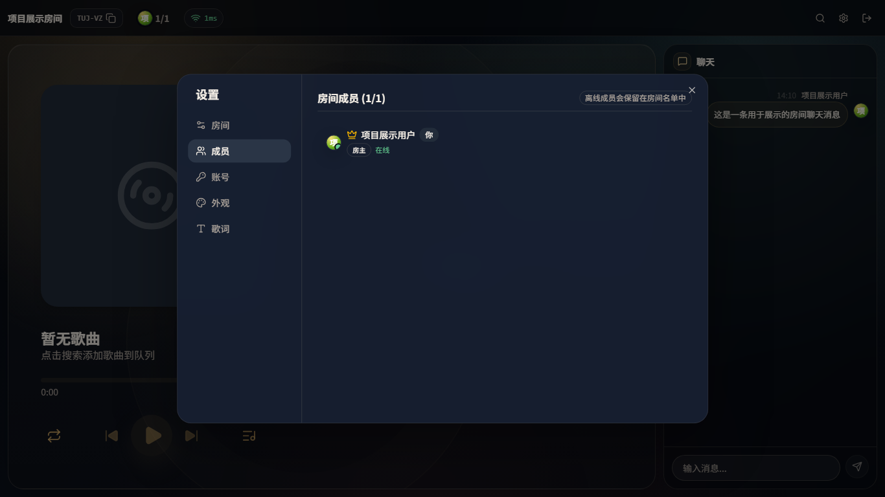
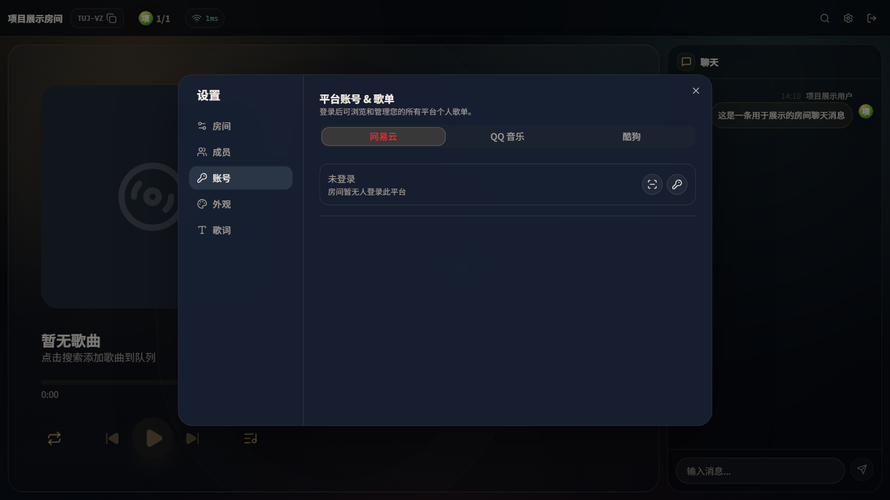
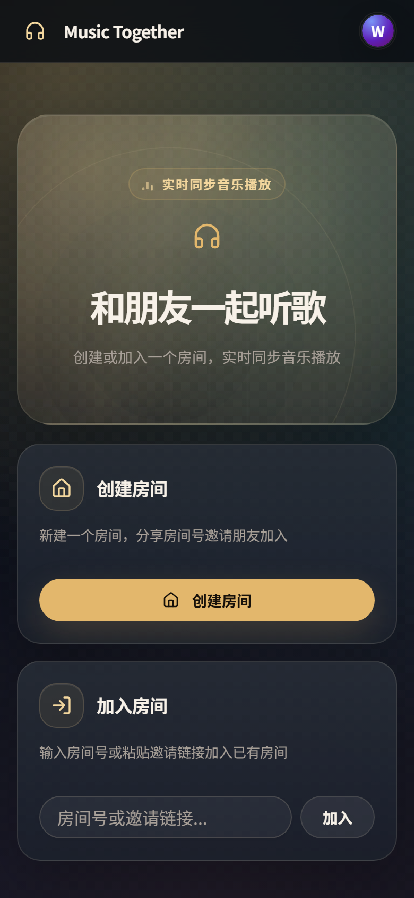

# Music Together

## 项目概述

**Music Together** 是一个在线多人同步听歌平台。用户可以创建房间、邀请朋友加入，并在同一个房间中同步播放音乐、搜索点歌、管理播放队列和实时聊天。相比普通的本地播放器或单人音乐网站，本项目重点解决的是“多人一起听同一首歌”的体验：房间内所有成员看到相同的播放队列、歌曲进度、歌词和聊天内容。

本仓库为 **`Madokamaes/music-together`**，改自上游开源项目 **`Yueby/music-together`**。在原项目实时同步听歌能力的基础上，本项目主要面向自托管和长期使用场景进行了改造：加入 SQLite 持久数据库与账户体系，并重写、重新设计了前端界面。

本文中的截图均来自当前项目的本地运行页面，位于 `screenshots/` 目录下。

## 快速开始

需要 Node.js 22、Corepack 和 pnpm：

```bash
git clone https://github.com/Madokamaes/music-together.git
cd music-together
corepack enable
corepack pnpm install
corepack pnpm dev
```

本地默认端口：

- 前端：`http://localhost:5173`
- Music Together 服务端：`http://localhost:3001`

在线服务：

- Music Together：<http://47.94.44.206:3001/>
- 幻想音乐杯：<http://47.94.44.206:3002/>

可以复制 `.env.example` 为 `.env` 后调整服务端配置。如果当前 shell 找不到裸 `pnpm`，请直接使用 `corepack pnpm`。

## 最近更新

个人使用的 **幻想音乐杯** 已迁移到独立仓库 [Madokamaes/music-cup](https://github.com/Madokamaes/music-cup)，独立运行于 <http://47.94.44.206:3002/>。Music Together 首页只保留固定外部入口，不再构建、挂载或部署其页面、API 与本地曲库。

## 部署

项目默认构建为单个 Docker 镜像，由 Express 同时提供 REST API、Socket.IO 和前端 SPA。仓库中的 GitHub Actions 会在 `main` 分支相关文件更新时构建镜像、推送至 GHCR，并通过 SSH 执行 `scripts/deploy-production.sh`。

手动运行 Docker：

```bash
docker run -d \
  --name music-together \
  --restart unless-stopped \
  -p 3001:3001 \
  -v music-together-data:/app/data \
  -e DATA_DIR=/app/data \
  -e IDENTITY_SECRET='replace-with-a-stable-random-secret' \
  ghcr.io/madokamaes/music-together:latest
```

### 持久化与必要密钥

必须挂载 `/app/data`，否则容器重建会丢失 SQLite 数据库和头像文件。生产环境必须固定 `IDENTITY_SECRET`；更换它会让已有用户 identity cookie 失效。

默认持久化路径：

- `DATA_DIR=/app/data`
- `DATABASE_PATH=/app/data/music-together.sqlite`
- `AVATAR_DIR=/app/data/avatars`

默认情况下，前端按当前页面 origin 连接后端，服务端 CORS 处于自动模式。需要显式白名单时再配置 `CLIENT_URL` 和 `CORS_ORIGINS`。

---

## 1. 首页：创建房间、加入房间与房间大厅



首页是用户进入系统后的第一个页面，主要提供三类能力：

- **创建房间**：新建同步听歌房间，并通过房间号或邀请链接分享给朋友。
- **加入房间**：输入房间号或粘贴邀请链接，进入已有房间。
- **活跃房间列表**：展示当前公开房间，方便用户直接进入。

房间既可以公开显示在大厅中，也可以被房主设置为隐藏。隐藏房间不会出现在大厅列表中，但仍然可以通过完整房间号或邀请链接加入，适合朋友之间的小范围听歌场景。

---

## 2. 持久账户与个人资料



本项目加入了持久账户能力。用户不再只是临时昵称，而是拥有可持久识别的账号身份。

个人资料区域支持：

- 查看并复制账号 ID
- 修改昵称
- 上传头像
- 重置头像
- 设置账号密码
- 使用账号 ID 与密码在其他浏览器恢复身份

用户身份通过服务端签发的 HttpOnly identity cookie 识别，昵称、头像、账号 ID 和密码哈希会保存到数据库中。这样即使用户更换浏览器，或者原来的 cookie 丢失，也可以通过账号 ID 和密码找回同一身份。

---

## 3. 创建房间流程



创建房间时，用户可以填写：

- 昵称
- 房间名
- 是否设置房间密码

房间创建成功后，用户会进入房间页面。当前版本的房间已经从“临时运行时房间”改造成“持久房间”：只要房主没有主动解散，房间不会因为服务重启或暂时无人在线而消失。

---

## 4. 房间播放主界面



房间页面是项目的核心使用场景。页面左侧是播放器区域，右侧是聊天区域，顶部显示房间名、房间号、在线人数和网络延迟。

房间内支持：

- 当前歌曲展示
- 播放 / 暂停
- 上一首 / 下一首
- 进度同步
- 播放队列
- 房间聊天
- 成员状态
- 搜索点歌
- 房间设置

多人同步播放通过 Socket.IO 实时同步播放状态，并结合服务端时间校准与调度机制，尽量保证不同客户端在同一时间点执行播放动作。

---

## 5. 搜索点歌与多音源支持



进入房间后，用户可以打开搜索点歌窗口。项目支持多个音乐来源：

- 网易云音乐
- QQ 音乐
- 酷狗音乐

搜索窗口支持按单曲、专辑、歌单进行搜索。搜索结果可以加入队列，也可以插入到当前播放歌曲之后。对于多人房间来说，点歌不是某个用户的本地操作，而是会同步到整个房间的播放队列中。

项目还支持平台 Cookie / VIP Cookie 池，用于部分需要会员权限或登录状态的歌曲播放场景，使房间可以共享可用的播放能力。

---

## 6. 房间聊天



房间右侧提供实时聊天面板，用户可以一边听歌一边交流。聊天消息会通过 WebSocket 实时广播到房间内所有成员。

当前版本还将聊天记录纳入持久化存储，聊天消息会保存发送者昵称和头像快照。这样即使用户之后修改昵称或头像，历史聊天记录仍然能保留当时的展示信息。

---

## 7. 房间设置、隐藏房间与持久房间



房间设置中可以管理房间的关键属性，例如：

- 房间名
- 房间号
- 邀请链接
- 音质
- 房间密码
- 隐藏房间

其中，**隐藏房间** 是当前版本新增的长期使用能力之一。隐藏后，房间不会出现在大厅中，但通过完整房间号或邀请链接仍可加入。

房间数据会写入 SQLite 数据库，包括房间基本信息、成员、队列、播放状态、聊天消息等。服务端重启后可以从数据库恢复房间状态，使项目更适合自托管和长期运行。

---

## 8. 成员管理与离线保留



成员管理页面展示房间成员列表和在线状态。当前版本支持持久成员关系：

- 加入过房间的用户会保留在成员名单中
- 用户离开或断开连接后显示为离线
- 房主和管理员可以管理成员权限
- 房间可以区分房主、管理员、普通成员

这让房间更像一个长期存在的音乐空间，而不是一次性的临时会话。

---

## 9. 平台账号与歌单



设置中的账号页面用于管理音乐平台相关能力。项目支持网易云、QQ 音乐、酷狗等平台账号状态，用于获取平台登录态、读取私有歌单或支持需要登录 / VIP 权限的播放场景。

这一部分和房间级 Cookie 池结合后，可以让房间共享部分平台播放能力，同时保留用户级歌单读取能力。

---

## 10. 移动端适配



项目重写前端时也考虑了移动端适配。首页、房间、弹窗、抽屉和设置面板都采用响应式布局，在手机宽度下会自动调整为更适合触屏操作的排列方式。

这使 Music Together 不只适合桌面浏览器，也可以在手机浏览器中创建房间、加入房间和进行基础操作。

---

## 11. 独立项目：幻想音乐杯

幻想音乐杯已经迁移为独立仓库与独立服务：

- 项目仓库：<https://github.com/Madokamaes/music-cup>
- 在线地址：<http://47.94.44.206:3002/>

Music Together 与幻想音乐杯仅通过首页固定外链互相访问，不共享代码、进程、API、数据库、身份 Cookie 或音乐平台登录状态。

---

## 12. 项目来源

本项目改自开源项目：

> **Yueby/music-together**

当前仓库为：

> **Madokamaes/music-together**

当前项目是在原有 Music Together 的基础上进行二次开发和功能增强。原项目已经具备多人同步听歌、房间、播放控制、歌词、聊天等基础能力；当前版本主要面向更长期、更稳定的自托管使用场景进行了改造。

---

## 13. 相比原项目的主要修改

### 13.1 加入持久数据库

原项目更偏向临时房间和运行时状态管理，而当前项目加入了 SQLite 数据库存储能力。

现在以下数据可以持久保存：

- 房间信息
- 房间成员
- 播放队列
- 当前播放状态
- 聊天消息
- 用户资料
- 账号密码哈希
- 头像信息
- 听歌统计记录

这意味着服务重启后，房间和用户数据不会简单丢失。只要房主没有主动解散房间，房间就可以长期存在。

### 13.2 加入账户与身份恢复能力

当前版本加入了持久用户身份体系：

- 用户身份通过 HttpOnly identity cookie 识别
- 昵称和头像保存到数据库
- 用户可以为当前账号设置密码
- 保存账号 ID 后，可以在更换浏览器或丢失 cookie 后恢复原身份
- 头像上传后会统一裁剪压缩为 256×256 WebP

这解决了原先临时身份容易丢失的问题，使用户可以长期使用同一个身份参与房间、保留资料和成员关系。

### 13.3 房间改为长期存在

当前版本支持永久房间：

- 房间不会因为没人在线自动消失
- 服务重启后可以从数据库恢复房间
- 已加入成员会保留在成员名单中
- 离线成员会显示为离线状态
- 房主可以主动删除 / 解散房间
- 房间可以设置为隐藏，仅通过房间号或链接加入

这使项目更适合部署成长期服务，而不是一次性演示应用。

### 13.4 重写和重新设计前端界面

当前项目对前端进行了明显重写和视觉升级。新版前端使用：

- React 19
- Vite 7
- TypeScript
- Tailwind CSS v4
- shadcn/ui
- Zustand

界面重点优化了首页、创建与加入房间流程、播放区域、搜索点歌、聊天、队列、歌词、设置面板和移动端适配，整体体验更接近完整的在线音乐产品。

---

## 14. 技术栈与目录

项目采用 pnpm workspace 组织为 monorepo，主要包含三个包：

- `packages/client`：前端 React 应用
- `packages/server`：后端 Node.js 服务
- `packages/shared`：前后端共享类型、事件和权限定义

| 模块     | 技术                                                              |
| -------- | ----------------------------------------------------------------- |
| 前端     | React 19、Vite 7、TypeScript、Tailwind CSS v4、shadcn/ui、Zustand |
| 后端     | Node.js、Express 4、Socket.IO 4                                   |
| 数据库   | SQLite、better-sqlite3                                            |
| 音频播放 | Howler.js                                                         |
| 歌词展示 | applemusic-like-lyrics                                            |
| 部署     | Docker、GitHub Actions、GHCR、SSH                                 |

## 常用验证命令

```bash
corepack pnpm --dir packages/shared exec tsc -p tsconfig.build.json --noEmit
corepack pnpm --dir packages/server exec tsc --noEmit
corepack pnpm --filter @music-together/client typecheck
```

## 架构文档

- [项目速查手册](docs/PROJECT_ARCHITECTURE.md)
- [目录结构](docs/architecture/directory-structure.md)
- [数据流与 API](docs/architecture/data-flow.md)
- [依赖关系](docs/architecture/dependencies.md)
- [部署说明](docs/architecture/deployment.md)
- [开发指南](docs/architecture/dev-guide.md)

---

## 15. 项目功能总结

当前版本的 Music Together 可以概括为：

> 一个支持自托管、持久账户、永久房间和多人实时同步播放的在线音乐房间系统。

相比原项目，当前版本最重要的改造方向是：

1. **从临时房间变成持久房间**
2. **从临时昵称变成可恢复账户**
3. **从内存状态变成 SQLite 数据库存储**
4. **从基础界面升级为重写后的现代化前端**
5. **从演示型应用增强为可部署、可长期使用的自托管服务**
6. **通过固定外链连接独立部署的幻想音乐杯**

本项目适合用于朋友群、社群、私人服务器或课程项目展示，体现实时通信、前后端协作、状态同步、数据库持久化和现代前端设计等多个方面的综合能力。

## 协议

[AGPL-3.0](LICENSE)
